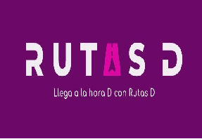
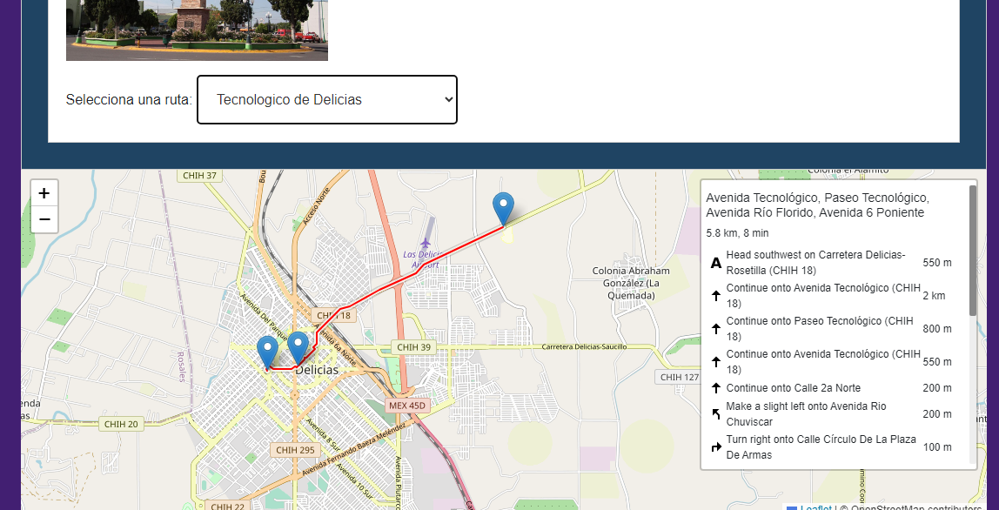

# Rutas D

Mobile application developed for the InnovaTec competition focused on public transportation route consultation in Delicias, Chihuahua.

## Overview

Rutas D was created to help users identify and consult public transportation routes through an interactive map interface.

The application allows users to select a destination and visualize the recommended route, including navigation instructions and route information.

This project advanced to the Regional Stage of the InnovaTec competition.

## Technologies

### Mobile Development
- Flutter

### Backend & Services
- Firebase

### Mapping
- OpenStreetMap
- Leaflet
- Geolocation Services

## Features

- Public transportation route consultation
- Interactive route visualization
- Turn-by-turn navigation instructions
- Destination selection
- Mobile-friendly interface

## Competition

- Developed for InnovaTec
- Qualified for Regional Stage
- Team project

## Screenshots

### Application Logo

### Interactive Route Map

## Learning Outcomes

Through this project I gained experience in:

- Mobile application development
- Map integration
- Geolocation systems
- User interface design
- Team collaboration
- Project presentation and competition participation

## Note

This repository showcases the project and its functionality. Source code is not publicly available.
